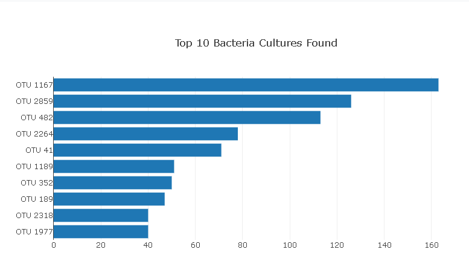
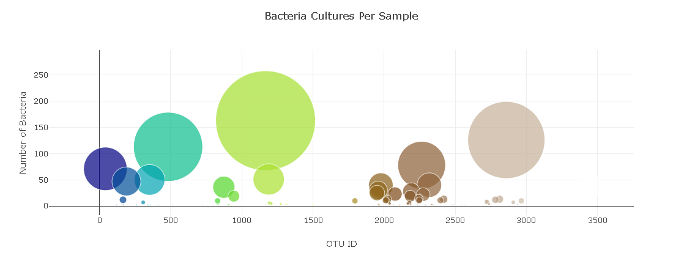
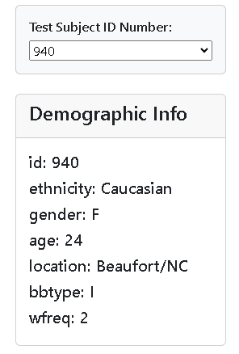
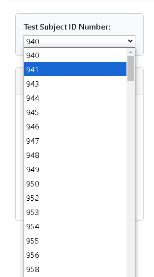
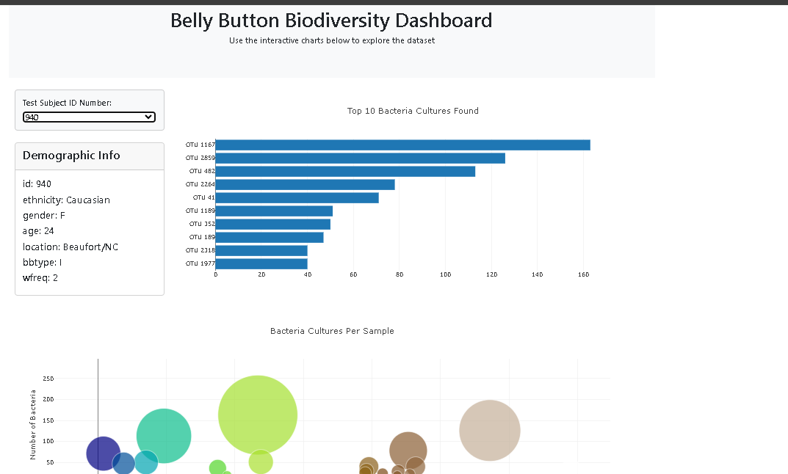

Belly Button Biodiversity Dashboard
This project involves creating an interactive dashboard to explore the Belly Button Biodiversity dataset, which catalogs the microbes that colonize human navels. The project includes visualizations such as bar and bubble charts and displays metadata information for individuals, all updated dynamically based on user input. The app is deployed using GitHub Pages.

Table of Contents
* Overview
* Features
* Instructions
* Deployment

Overview
The Belly Button Biodiversity dataset reveals microbial species found in human navels. This dashboard allows users to:

View the top 10 OTUs for an individual.
* Explore all OTUs using a bubble chart.
* Display metadata for each individual.
* Dynamically update visualizations based on user selection.

Features
Horizontal Bar Chart:

Displays the top 10 OTUs for a selected individual.
Uses sample_values as values, otu_ids as labels, and otu_labels as tooltips.
Bubble Chart:

Visualizes all OTUs for a selected individual.
Uses otu_ids for x-axis and marker colors, sample_values for y-axis and marker size, and otu_labels for text.
Metadata Display:

Shows demographic information for the selected individual.
Dynamic Updates:

All charts and metadata update based on the selected sample.
Deployment:

Hosted on GitHub Pages for easy access.

Instructions
1. Bar Chart - Top 10 OTUs
Create a horizontal bar chart using the D3 library.
Data Sources:
sample_values for bar heights.
otu_ids for bar labels.
otu_labels for hover text.
A dropdown menu allows users to select a sample, updating the chart dynamically.

2. Bubble Chart - All OTUs
Create a bubble chart to display all OTUs for a selected individual.
Data Mapping:
otu_ids: x-axis and marker colors.
sample_values: y-axis and marker sizes.
otu_labels: hover text.
The chart updates dynamically when a new sample is selected.

3. Metadata Display
Display the demographic information for the selected individual.
Loop through the metadata object and display each key-value pair as a text string.
Append the metadata to the #sample-metadata HTML panel.

4. Dynamic Updates
Update all charts and the metadata panel when a new sample is selected from the dropdown menu.
Ensure seamless interaction and responsive data visualization.

Deployment
The application is deployed using GitHub Pages.
